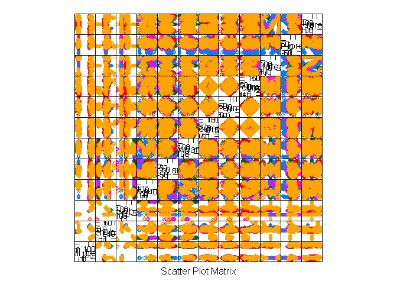

# Statistical Prediction Model for Human Acitivy Recognition using Weight Lifting Exercise Dataset
Kumar Chandrakant  
March 17, 2016  


## Executive Summary
The objective of this report is to present a statistical model build on top of the Weight Lifting Exercise Dataset collected from accelerometers on the belt, forearm, arm, and dumbbell of 6 participants. The objective of this exercise if to predict how well individuals perform a benchmarked activity like lifting a dumbbell. We will be using the raw data provided at the course site and perform relevant exploratory analysis to decide on the features to retain as predictors. We will then proceed to model fitting, evaluation and eventually prediction for the provided test set.

## Base Setup
We will make use of the functions from caret package in report and hence loading it.

```r
library(caret)
```

## Data Loading
We begin by downloading the raw dataset provided as part of the assignment. The downloaded datasets are then read into the environment.

```r
download.file("https://d396qusza40orc.cloudfront.net/predmachlearn/pml-training.csv", "./data/pml-training.csv")
download.file("https://d396qusza40orc.cloudfront.net/predmachlearn/pml-testing.csv", "./data/pml-testing.csv")
training_full <- read.csv("./data/pml-training.csv")
testing <- read.csv("./data/pml-testing.csv")
```

## Exploratory Analysis
We perform some exploratory analysis of the data to understand what features to keep for model fitting. We begin by looking into the dimension of the data.

```r
dim(training_full)
```

```
## [1] 19622   160
```
We know now that our training dataset consists of 19622 observations and 160 variables out of which 159 are predictors. That’s a huge number of predictors! Obviously not all of these would be appropriate for the purpose of model fitting.

A quick read through the documentation of data present at (http://groupware.les.inf.puc-rio.br/har) it is evident that data is collected from sensors at four locations i.e. dumbbell, forearm, arm and belt. Let us see what the predictors available are for each of them.

```r
grep("dumbbell", names(training_full), value = TRUE)
```

```
##  [1] "roll_dumbbell"            "pitch_dumbbell"          
##  [3] "yaw_dumbbell"             "kurtosis_roll_dumbbell"  
##  [5] "kurtosis_picth_dumbbell"  "kurtosis_yaw_dumbbell"   
##  [7] "skewness_roll_dumbbell"   "skewness_pitch_dumbbell" 
##  [9] "skewness_yaw_dumbbell"    "max_roll_dumbbell"       
## [11] "max_picth_dumbbell"       "max_yaw_dumbbell"        
## [13] "min_roll_dumbbell"        "min_pitch_dumbbell"      
## [15] "min_yaw_dumbbell"         "amplitude_roll_dumbbell" 
## [17] "amplitude_pitch_dumbbell" "amplitude_yaw_dumbbell"  
## [19] "total_accel_dumbbell"     "var_accel_dumbbell"      
## [21] "avg_roll_dumbbell"        "stddev_roll_dumbbell"    
## [23] "var_roll_dumbbell"        "avg_pitch_dumbbell"      
## [25] "stddev_pitch_dumbbell"    "var_pitch_dumbbell"      
## [27] "avg_yaw_dumbbell"         "stddev_yaw_dumbbell"     
## [29] "var_yaw_dumbbell"         "gyros_dumbbell_x"        
## [31] "gyros_dumbbell_y"         "gyros_dumbbell_z"        
## [33] "accel_dumbbell_x"         "accel_dumbbell_y"        
## [35] "accel_dumbbell_z"         "magnet_dumbbell_x"       
## [37] "magnet_dumbbell_y"        "magnet_dumbbell_z"
```
As we can see there are 38 predictors available for each of these locations but not all of these are raw covariates.

```r
grep("kurtosis|skewness|max|min|amplitude|var|avg|stddev", grep("dumbbell", names(training_full), value = TRUE), value = TRUE)
```

```
##  [1] "kurtosis_roll_dumbbell"   "kurtosis_picth_dumbbell" 
##  [3] "kurtosis_yaw_dumbbell"    "skewness_roll_dumbbell"  
##  [5] "skewness_pitch_dumbbell"  "skewness_yaw_dumbbell"   
##  [7] "max_roll_dumbbell"        "max_picth_dumbbell"      
##  [9] "max_yaw_dumbbell"         "min_roll_dumbbell"       
## [11] "min_pitch_dumbbell"       "min_yaw_dumbbell"        
## [13] "amplitude_roll_dumbbell"  "amplitude_pitch_dumbbell"
## [15] "amplitude_yaw_dumbbell"   "var_accel_dumbbell"      
## [17] "avg_roll_dumbbell"        "stddev_roll_dumbbell"    
## [19] "var_roll_dumbbell"        "avg_pitch_dumbbell"      
## [21] "stddev_pitch_dumbbell"    "var_pitch_dumbbell"      
## [23] "avg_yaw_dumbbell"         "stddev_yaw_dumbbell"     
## [25] "var_yaw_dumbbell"
```
As we can see out of these 38 covariates 25 are not raw which leaves 13 covariates as raw covariates for each location.

## Approach
We will begin by slicing the raw training data set into training and validation sets. We will keep 60% for training and rest for validation. Based on the exploratory analysis of the covariates we will begin by including only some of the covariates and proceed with model fitting and validation. Based on the accuracy achieved we will include or replace covariates. Our intention is to achieve an accuracy of at least 98%.

## Data Cleaning
Let us begin by retaining only the raw covariates and the predicted variable in training and testing data sets.

```r
training_full <- training_full[, grepl("dumbbell|belt|forearm|arm|classe", names(training_full))]
training_full <- training_full[, !grepl("kurtosis|skewness|max|min|amplitude|var|avg|stddev", names(training_full))]
testing <- testing[, grepl("dumbbell|belt|forearm|arm|problem_id", names(testing))]
testing <- testing[, !grepl("kurtosis|skewness|max|min|amplitude|var|avg|stddev", names(testing))]
```

## Data Slicing
We will now create training and validation sets out of the raw raining set. We will set the seed for the purpose of reproducibility.

```r
set.seed(331)
inTrain = createDataPartition(training_full$classe, p = 0.6)[[1]]
training = training_full[ inTrain,]
validation = training_full[-inTrain,]
```

## Model Fitting
We will use random forest as our method due to the fact that it can automatically pick the most relevant predictors out of the provided ones and normally gives high level of accuracy for this kind of classification problem. As fitting a model with random forest is computationally expensive we will begin with a subset of originally selected covariates.

```r
training_subset <- training[, grepl("^roll|^pitch|^yaw|classe", names(training))]
```

Let’s create a pair plot of the selected covariates to see if the choice is good.

```r
featurePlot(x=training_subset[,!(names(training_subset) %in% c("classe"))], y=training_subset$classe, plot="pairs")
```



We will now perform the model fitting.

```r
model <- train(classe~., data=training_subset, method="rf")
```
Let us see what the fitted model looks like.

```r
model
```

```
## Random Forest 
## 
## 11776 samples
##    12 predictor
##     5 classes: 'A', 'B', 'C', 'D', 'E' 
## 
## No pre-processing
## Resampling: Bootstrapped (25 reps) 
## Summary of sample sizes: 11776, 11776, 11776, 11776, 11776, 11776, ... 
## Resampling results across tuning parameters:
## 
##   mtry  Accuracy   Kappa      Accuracy SD  Kappa SD   
##    2    0.9775685  0.9716436  0.003240003  0.004085993
##    7    0.9765878  0.9704086  0.002741863  0.003451831
##   12    0.9683545  0.9600026  0.003697838  0.004658410
## 
## Accuracy was used to select the optimal model using  the largest value.
## The final value used for the model was mtry = 2.
```
The in-sample accuracy for the selected final model is 97.7% and the in-sample error rate is 2.3%.

## Model Evaluation
We will now use the validation data set to check the accuracy of the selected model.

```r
validation_subset <- validation[, grepl("^roll|^pitch|^yaw|classe", names(validation))]
predict <- predict(model, newdata=validation_subset)
confusionMatrix(validation$classe, predict)
```

```
## Confusion Matrix and Statistics
## 
##           Reference
## Prediction    A    B    C    D    E
##          A 2219    5    5    3    0
##          B   21 1465   28    4    0
##          C    0    8 1344   15    1
##          D    2    2    8 1274    0
##          E    0    1   12    6 1423
## 
## Overall Statistics
##                                           
##                Accuracy : 0.9846          
##                  95% CI : (0.9816, 0.9872)
##     No Information Rate : 0.2858          
##     P-Value [Acc > NIR] : < 2.2e-16       
##                                           
##                   Kappa : 0.9805          
##  Mcnemar's Test P-Value : NA              
## 
## Statistics by Class:
## 
##                      Class: A Class: B Class: C Class: D Class: E
## Sensitivity            0.9897   0.9892   0.9621   0.9785   0.9993
## Specificity            0.9977   0.9917   0.9963   0.9982   0.9970
## Pos Pred Value         0.9942   0.9651   0.9825   0.9907   0.9868
## Neg Pred Value         0.9959   0.9975   0.9918   0.9957   0.9998
## Prevalence             0.2858   0.1888   0.1781   0.1659   0.1815
## Detection Rate         0.2828   0.1867   0.1713   0.1624   0.1814
## Detection Prevalence   0.2845   0.1935   0.1744   0.1639   0.1838
## Balanced Accuracy      0.9937   0.9904   0.9792   0.9883   0.9982
```
As we can see the out-of-sample accuracy of the selected model is coming as 98.46% which is higher than what we intended to achieve and hence we will not perform any further exercise of model fitting and proceed to test this model on out testing data set. The out-of-sample error rate for this model is thus 1.54%.

## Model Prediction
We will use the testing data set provided earlier to predict the class using the selected model.

```r
testing_subset <- testing[, grepl("^roll|^pitch|^yaw|problem_id", names(testing))]
testing_subset$classe <- predict(model, newdata=testing_subset)
table(testing_subset$problem_id, testing_subset$classe)
```

```
##     
##      A B C D E
##   1  0 1 0 0 0
##   2  1 0 0 0 0
##   3  0 1 0 0 0
##   4  1 0 0 0 0
##   5  1 0 0 0 0
##   6  0 0 0 0 1
##   7  0 0 0 1 0
##   8  0 1 0 0 0
##   9  1 0 0 0 0
##   10 1 0 0 0 0
##   11 0 1 0 0 0
##   12 0 0 1 0 0
##   13 0 1 0 0 0
##   14 1 0 0 0 0
##   15 0 0 0 0 1
##   16 0 0 0 0 1
##   17 1 0 0 0 0
##   18 0 1 0 0 0
##   19 0 1 0 0 0
##   20 0 1 0 0 0
```
The predicted class for each of the testing data observation is presented above.
